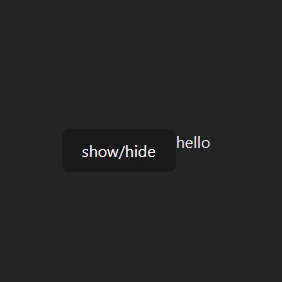

# React Transition

a simple component for element transition in React



## Installation

The package can be installed via [npm](https://github.com/npm/cli):

```
npm install react-element-transition --save
```

## Usage

React Component:

```javascript
import {ReactTransition} from "./components";
import {useState} from "react";

function App() {
  const [isShow, setIsShow] = useState(true)
  return (
    <div>
      <button onClick={() => setShow(!show)}>show/hide</button>
      
      <ReactTransition value={show} onTransitionEnd={doSomtingh} name="fade" ref="fooRef">
        <div>hello</div>
      </ReactTransition>
    </div>
  )
}

export default App
```

Transition CSS
<br>
add in your styles file.

```css
.fade-enter-active,
.fade-leave-active {
  transition: opacity .4s ease;
}

.fade-enter-from,
.fade-leave-to {
  opacity: 0;
}
```

## Props
Here are the props that can be passed to the `<ReactTransition />` component:

| Prop Name         | Type              | Default Value | Description|
|-------------------|-------------------|---------------|------------|
| `value`           | `Boolean`         | `true`        | Controls the visibility of the component. |
| `onTransitionEnd` | `Function`        | `undefiend`   | Event handler for transition end.|
| `name`            | `String`          | `fade`        | Specifies the class name for styling.|
| `ref`             | `React.RefObject` | `undefiend`   | A forwarded ref for accessing the child component's instance or DOM node.|
| `children`             | `ReactElement`    | `null`        | Nested content to be rendered inside the component.|

### Prop Details

#### `children`

- **Type:** `ReactElement`
- **Default Value:** `null`
- **Description:** Nested content to be rendered inside the component. **Note:** It's recommended to always wrap children inside a `div`.

## Contributing
If you want to contribute to this project and make it better, your help is very welcome. Create an issue or submit a pull request.

## Acknowledgments

my project's simple transition effects draw inspiration from the powerful capabilities of Vue.js transitions.

### Vue.js

- **Project:** [Vue.js](https://vuejs.org/)
- **Feature:** [Vue Transition](https://vuejs.org/v2/guide/transitions.html)
 
The simplicity and effectiveness of Vue.js transitions have influenced the design of our basic transition features. We extend our appreciation to the Vue.js community for their powerful and versatile solutions.

Special thanks to my friend [mehdi](https://github.com/meyt) who helped and support during the development of this project.

